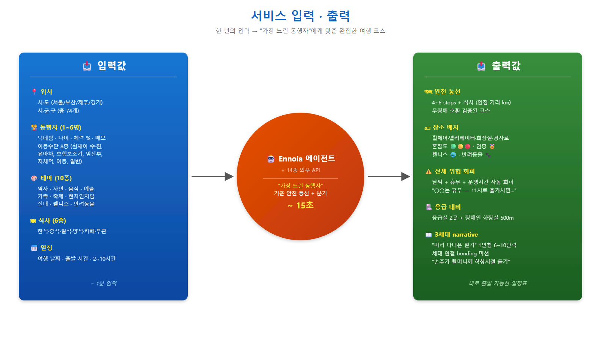
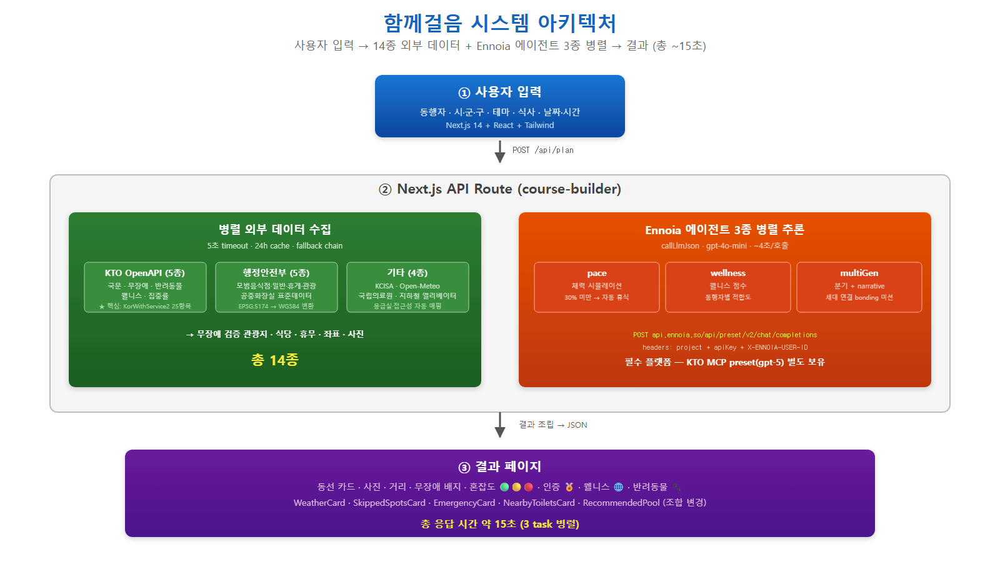
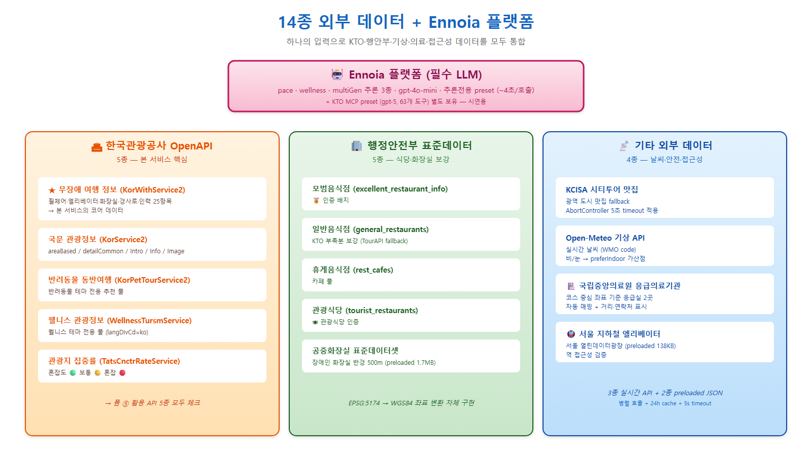
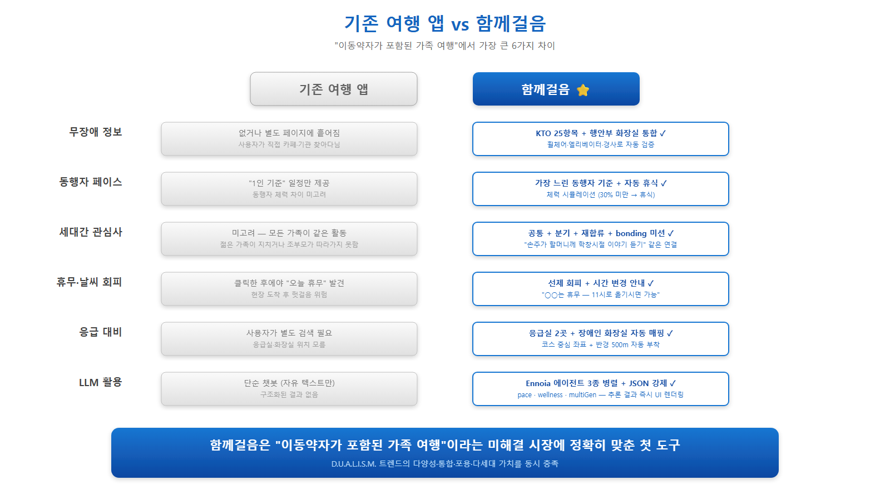

<div align="center">

# 함께걸음 · TripForAll

**이동약자·다세대 가족을 위한 무장애 동반 여행 AI 어시스턴트**

*"휠체어 할머니부터 8살 손주까지 — 한 코스로 함께 걸을 수 있게."*

[](https://nextjs.org/)
[](https://www.typescriptlang.org/)
[](https://tailwindcss.com/)
[](https://ennoia.so)
[](https://api.visitkorea.or.kr/)

**2026 관광데이터 활용 공모전 · 생성형 AI 활용 관광 프롬프톤 응시작**

</div>

---

## 🎯 한 줄 요약

> **"우리는 이동약자와 다세대 가족이 함께 갈 수 있는 여행 코스가 없다는 문제를,
> 무장애·페이스·세대 분기를 통합한 AI 동반자를 통해 해결합니다."**

## 🎬 시연 영상

[`docs/submission/함께걸음_시연영상.mp4`](docs/submission/함께걸음_시연영상.mp4) — **3분 32초** · 1920×1080 · 한국어 내레이션 자동 생성 (Microsoft Edge Neural TTS) · 16 장면

---

## 🌍 문제 정의

한국 관광 시장은 **D.U.A.L.I.S.M. 트렌드**(다양성·통합·진정성·로컬·포용·지속가능성·다세대)로 진입했지만, 기존 도구는 따라가지 못합니다.

| 현실 | 기존 서비스 한계 |
|---|---|
| 고령화·돌봄 가족 증가 — 휠체어·임산부 비중 급증 | 무장애 정보 흩어져 있음, "동행자 전원에게 맞는" 추천 부재 |
| 3세대 동반 여행 증가 | 가장 느린 사람 기준 페이스·세대별 관심사 충돌 미해결 |
| 다양한 테마 수요 (현지인·웰니스·반려동물) | "관광지 리스트"만 나열 |
| 운영시간·휴무·날씨 변경 필요 | 클릭한 후에야 "오늘 휴무" 발견 |

**👉 이동약자 본인이 아니라 동행 가족이 여정을 짜야 하는 경우, 무장애 + 동선 + 휴무 + 세대 분기를 한 번에 챙기는 도구가 없습니다.**

---

## 🚀 솔루션 — 한 번의 입력 → 완전한 코스



### 7개 핵심 기능

| | 기능 | 설명 |
|---|---|---|
| 🦽 | **무장애 매칭** | KTO 25항목 검증 (휠체어·엘리베이터·화장실·경사로) + 행안부 화장실 통합 |
| 🔋 | **체력 시뮬레이션** | 가장 느린 동행자 기준 · 30% 미만 → 자동 휴식 삽입 |
| 👨‍👩‍👧 | **세대 연결 동선** | 공통 + 분기 + 재합류 + bonding 미션 ("손주가 할머니께 학창시절 듣기") |
| ⚠️ | **선제적 위험 회피** | 휴무·날씨 자동 회피 + 시간 변경 안내 ("11시로 옮기시면 가능") |
| 🏥 | **응급 대비** | 응급실 2곳 + 장애인 화장실 반경 500m 자동 매핑 |
| 🎲 | **다른 조합 보기** | 같은 입력에서 새로운 anchor 재추천 + 풀에서 spot 선택 재구성 |
| 📖 | **3세대 narrative** | "미리 다녀온 일기"처럼 1인칭 6~10단락 |

**평균 응답 시간 ~15초** · 8종 이동수단 · 10종 테마 · 4시·도 74개 시·군·구

---

## 🏗 아키텍처



```
사용자 입력 (Next.js + Tailwind)
       │
       ▼  POST /api/plan
Next.js API Route (course-builder)
   ├─ 병렬 외부 데이터 수집 (5초 timeout · 24h cache)
   │     KTO 5종 · 행안부 식당 4종 · KCISA · Open-Meteo
   │     국립의료원 응급실 · 지하철 엘리베이터 · 장애인 화장실
   └─ Ennoia 에이전트 3종 병렬 추론
         pace · wellness · multiGen
         → POST api.ennoia.so/api/preset/v2/chat/completions
       │
       ▼
결과 페이지 (Next.js)
  동선 + 무장애 배지 + 휴무 안내 + 응급실 + 화장실
```

---

## 📡 데이터 소스 (14종 + Ennoia)



### 🏛 한국관광공사 OpenAPI (5종 — 필수 평가 항목)

| API | 용도 |
|---|---|
| **무장애 여행 정보** (KorWithService2) | 휠체어·엘리베이터·화장실·경사로·인력 **25항목** — 본 서비스 핵심 |
| **국문 관광정보** (KorService2) | areaBasedList / detailCommon / Intro / Info / Image |
| **반려동물 동반여행** (KorPetTourService2) | 반려동물 테마 전용 풀 |
| **웰니스 관광정보** (WellnessTursmService) | 웰니스 테마 전용 풀 (langDivCd=ko) |
| **관광지 집중률** (TatsCnctrRateService) | 혼잡도 🟢 🟡 🔴 |

### 🏢 행정안전부 표준데이터 (5종)
- 모범음식점 / 일반음식점 / 휴게음식점 / 관광식당
- 공중화장실 표준데이터셋 (장애인 화장실 매칭, EPSG:5174 → WGS84 변환)

### 📡 기타 (4종)
- KCISA 시티투어 맛집 / Open-Meteo 기상 / 국립중앙의료원 응급의료기관 / 서울 지하철 엘리베이터

### 🤖 LLM 플랫폼 — Ennoia (경진대회 필수)

- 엔드포인트: `POST https://api.ennoia.so/api/preset/v2/chat/completions`
- 인증: `project` + `apiKey` + `X-ENNOIA-USER-ID` 헤더 3종
- **2단 preset 구조**:
  - 추론전용 (`gpt-4o-mini`, MCP 없음) — 우리 3개 에이전트 호출용, **~4초/호출**
  - 한국관광공사 MCP (`gpt-5`, 63개 도구) — 시연/검증용, ~41초/호출
- 추론 작업과 데이터 수집을 분리해 응답 속도 10배 개선

LLM provider 우선순위: **Ennoia → OpenRouter → OpenAI → Anthropic** (4종 fallback)

---

## ⚙️ 시작하기

```bash
git clone https://github.com/bumbumei/Tripforall.git
cd Tripforall
pnpm install
cp .env.example .env.local
# .env.local 편집 후
pnpm dev
# → http://localhost:3000
```

### 필요한 환경변수 (`.env.local`)

```bash
# 한국관광공사 TourAPI (data.go.kr)
TOUR_API_KEY=...

# KCISA 시티투어 맛집
KCISA_API_KEY=...

# Ennoia (경진대회 필수, 4개 모두 있어야 활성)
ENNOIA_API_KEY=...
ENNOIA_PROJECT=KNTO-PROMPTON-2026-330
ENNOIA_PRESET_HASH=...        # Studio deploy log의 hash
ENNOIA_USER_ID=...            # Studio user_id (32-char hex, 이메일 아님)

# (선택) 추가 LLM provider
OPENROUTER_API_KEY=...
OPENAI_API_KEY=...
```

### 환경 확인

```bash
curl http://localhost:3000/api/diag
# 또는
pnpm verify
```

응답에서 `llm.provider`가 `ennoia`로 표시되고 `tourApi.attempts[].status === 200`이면 정상.

---

## 🆚 차별점



| 항목 | 기존 여행 앱 | **함께걸음** |
|---|---|---|
| 무장애 정보 | 없거나 별도 페이지 흩어짐 | KTO 25항목 + 행안부 화장실 통합 ✓ |
| 동행자 페이스 | "1인 기준" | 가장 느린 동행자 + 체력 시뮬 + 자동 휴식 ✓ |
| 세대간 관심사 | 미고려 | 공통 + 분기 + 재합류 + bonding 미션 ✓ |
| 휴무·날씨 회피 | 클릭 후 발견 | 선제 회피 + 시간 변경 안내 ✓ |
| 응급 대비 | 사용자가 별도 검색 | 응급실 2곳 + 화장실 자동 매핑 ✓ |
| LLM 활용 | 단순 챗봇 | Ennoia 에이전트 3종 병렬 + JSON 강제 ✓ |

---

## 🛠 시행착오 & 개선 (4건)

| # | 시행착오 | 개선 결과 |
|---|---|---|
| **1** | Ennoia `MCP_CONNECTION_REQUIRED` 인증 실패 (이메일을 user_id로 사용) | deploy log JSON에서 32자 hex UUID 발견 → HTTP 200, KTO MCP 호출 성공 |
| **2** | 첫 preset 응답 41초 (gpt-5 + MCP 63 도구) | 추론전용 preset 분리 → **4.2초** (~10배 단축) |
| **3** | KCISA API 60초 → 전체 응답 70초 폭증 | fallback 재정렬 + AbortController 5초 timeout → **7.6초** (~9배) |
| **4** | 강남구·실내 NO_COURSE (모두 11시 개점, 시작 10시) | 닫힌 picked spot 유지 + 휴무 사유 + 시간 변경 안내 |

**+ 프롬프트 튜닝**: narrative 톤 "1인칭 일기" / bonding 미션 "손주가 할머니께 학창시절 이야기 듣기"

---

## 📂 폴더 구조

```
app/
  page.tsx              # 랜딩
  plan/page.tsx         # 동행자/시·군·구/테마/날짜 입력
  result/page.tsx       # 결과 + 추천 풀 + narrative
  api/
    plan/route.ts       # 메인 API (14종 외부 데이터 + Ennoia 3종 병렬)
    diag/route.ts       # 환경·LLM·TourAPI 진단

lib/
  course-builder.ts     # 코스 생성 (반경·인접 거리·운영시간)
  llm.ts                # Provider-agnostic 래퍼 (Ennoia → OpenRouter → OpenAI → Anthropic)
  tour-api.ts           # KTO TourAPI 4.0 (KorWithService2 → KorService2 fallback)
  themes.ts             # 10개 테마 + 날씨 modifier
  sigungu.ts            # 74개 시·군·구 + 법정동 코드
  foodservice.ts        # 행정안전부 식당 API 4종 (EPSG:5174 변환)
  pet-tourism.ts        # KorPetTourService2
  wellness-tourism.ts   # WellnessTursmService
  crowd-forecast.ts     # TatsCnctrRateService
  weather.ts            # Open-Meteo
  openhours.ts          # 휴무/운영시간 파싱
  toilets.ts            # 행안부 화장실 (preloaded)
  subway-elevators.ts   # 서울 지하철 엘리베이터 (preloaded)
  emergency.ts          # 국립의료원 응급실
  prompts/
    pace.ts / wellness.ts / multigen.ts

docs/submission/        # 경진대회 제출 자료 (PPTX, PDF, 영상, 가이드, 이미지)

scripts/                # 빌드 자동화 (PPTX 채우기 · SVG→PNG · 영상 합성 등)
```

---

## 📦 제출 자료 (경진대회용)

[`docs/submission/`](docs/submission/) 에 정리:

- 📄 [`함께걸음_서비스소개서_TripForAll.pptx`](docs/submission/함께걸음_서비스소개서_TripForAll.pptx) — 양식 그대로 12장 + 인포그래픽 3장
- 📄 [`함께걸음_서비스소개서_TripForAll.pdf`](docs/submission/함께걸음_서비스소개서_TripForAll.pdf) — Marp 슬라이드 PDF
- 🎬 [`함께걸음_시연영상.mp4`](docs/submission/함께걸음_시연영상.mp4) — 3분 32초, 자막 .srt 포함
- 📝 [`10-form-answers.md`](docs/submission/10-form-answers.md) — 구글폼 Q1~Q5 + 7개 항목 답변
- ✅ [`30-user-actions.md`](docs/submission/30-user-actions.md) — Ennoia 공유 URL 생성 · 키 복사 · 폼 제출 체크리스트

---

## 🎯 데모 시나리오

`/plan` 기본값:
- 👵 할머니 78세 · 수동 휠체어 · "오래 못 걸어요" · 체력 60%
- 👩 어머니 52세 · 일반 · 체력 85%
- 👦 손주 8세 · 아동 · 체력 95%

서울 종로구 · 역사·궁궐 테마 · 한식 · 5시간 · 9:30 출발

→ 광화문역 5번출구 → 경복궁 → 통인시장 → 청계천 → 인사동
→ 근정전에서 15분 분기 (할머니 휴식 / 어머니·손주 경회루 산책) → 재합류
→ bonding: "손주가 할머니께 학창시절 이야기 듣기"
→ 자동 휴식 (할머니 30% 미만 직전)
→ 응급실 2곳 + 장애인 화장실 5곳 매핑

---

## 🏆 기대효과 (3관점)

**Product** — "휠체어 어머니와 못 가" → "할머니도 같이 갈 수 있어"로 가족 여행의 가능성 확장
**Business** — 17개 시·도 확대 (sigungu 매핑만 추가) · 외국인 무장애 관광 (KTO 다국어 8개) · B2B (요양시설·복지관·여행사)
**Technology** — Ennoia preset 2단 구조 + 14종 API fallback chain + 좌표·코드 통합 노하우

---

## 📜 라이선스 & 크레딧

- 데이터: [한국관광공사 TourAPI 4.0](https://api.visitkorea.or.kr/) · [행정안전부 표준데이터셋](https://www.data.go.kr/) · [KCISA](https://www.kcisa.kr/) · [Open-Meteo](https://open-meteo.com/) · [국립중앙의료원 응급의료기관](https://www.e-gen.or.kr/)
- LLM: [Ennoia 플랫폼](https://ennoia.so) (gpt-4o-mini + 한국관광공사 MCP)
- 양식: 한국관광공사 2026 관광 프롬프톤 서비스 소개서 양식
- 개발: 한승범 (`bumbumei@gmail.com`)
- 빌드 도구: Next.js 14 · python-pptx · edge-tts · Playwright · ffmpeg · Marp

---

<div align="center">

**누구도 두고 가지 않는 여행, 함께걸음 TripForAll**

</div>
